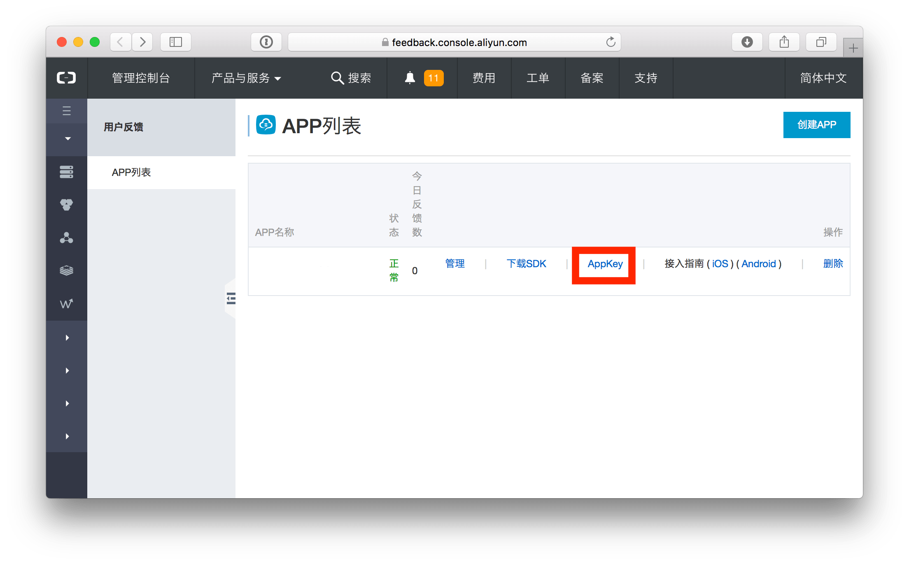

# 移动用户反馈 Demo iOS 版


<p align="center">
<a href=""></a>
<a href=""></a>
<a href=""></a>
<a href=""></a>
<a href=""></a>
</p>


<div align="center">


</div>


##一、产品介绍
用户反馈(Feedback)是一款帮助移动开发者在APP内收集消费者问题反馈和意见建议，并且在后台集中分析和回复的产品（此外，自动抓取开发者APP在应用市场的评论数据，帮助开发者及时掌握用户对应用的评论）。

##二、App客户端功能说明
* 1.发送文字
* 2.发送图片
* 3.App客户端UI自定义
* 4.显示未读消息数
* 5.发送语音

##三、管理控制台
* 1.回复消息
* 2.打标签
* 3.收藏反馈
* 4.搜索文字反馈
* 5.导出少量反馈
* 6.导出大量反馈
* 7.搜索反馈人
* 8.建立二级标签
* 9.自动打标签
* 10.批量打标签
* 11.批量回复
* 12.H5增加语音开关

##四、接入流程
* 1.注册阿里云账号。注册地址：https://account.aliyun.com/register/register.htm
* 2.阿里云官网https://cn.aliyun.com/ 选择-产品->移动服务->移动用户反馈。

* 3.没有应用，需要创建应用。
    
	管理控制台-》创建应用
	
	

* 4.客户端集成。

	 目前支持iOS、Android端
	 
     下载客户端SDK并集成，地址：https://mhub.console.aliyun.com/#/download
     
     
## Demo说明

该Demo提供了App不同应用场景集成移动用户反馈服务的示例。

Demo仅作为原理讲解和示例代码用途，
强烈建议在搞清楚各场景下移动用户反馈接入实现细节和原理后，再集成到App线上环境。


## 使用方法

### 1. 创建APP


您首先需要登入控制台，创建一个 APP 实体以对应您准备使用的 Demo APP。关于 APP 创建的指引文档可以参考：

- [ 《移动用户反馈 - 开发指南 - 终端SDK手册 - iOS SDK手册》]( https://help.aliyun.com/document_detail/53145.html?spm=5176.doc53324.6.555.KEwgHA ) 
 
创建完 APP 后，您还需要配置您的 APP ，注意 appkey 的设置，要与控制台保持一致，并根据业务需要选择是否开启鉴权功能。


### 2. 下载Demo工程

将工程克隆或下载到本地：

> git clone https://github.com/aliyun/alicloud-android-demo.git

本 Demo 的文件夹名字叫做：feedback_ios_demo。


**项目结构**


Demo的结构如下：做下说明：

 ```Objective-C


├── Image
├── YWFeedbackDemo                       # Demo 演示部分
│   ├── BCFeedback
│       ├── AlicloudUtils.framework       # SDK 依赖库
│       ├── BCConnectorBundle.framework   # SDK 依赖库
│       ├── BCHybridWebViewFMWK.framework # SDK 依赖库
│       ├── UTDID.framework.              # SDK 依赖库
│       ├── UTMini.framework              # SDK 依赖库
│       ├── YWFeedbackBundle.bundle.      # SDK 依赖资源
│       └── YWFeedbackFMWK.framework.     # SDK 库
└── YWFeedbackDemo.xcodeproj
        
 ```
 
**当您在使用您自己的 APP 集成 SDK 遇到问题时，您可以对比下 demo APP 的配置情况。**


### 3. 配置APP信息

3.1 配置 appkey、secretKey

为了使Demo APP能够正常运行，您还需要配置您的appkey/secretKey信息。您可以在移动推送控制台，您在第一步创建的APP中找到它们，如图所示：




### 4. 运行 Demo

用 Xcode 打开 `***.xcodeproj` 文件，即可运行该Demo。


## 联系我们

 
 - 官网：移动用户反馈[《移动用户反馈》]( https://help.aliyun.com/document_detail/53145.html?spm=5176.doc53324.6.555.KEwgHA ) 
 - 钉钉技术支持：11711519（钉钉群号）
 - 官方技术博客：[《阿里云移动服务》]( https://yq.aliyun.com/teams/32 ) 


